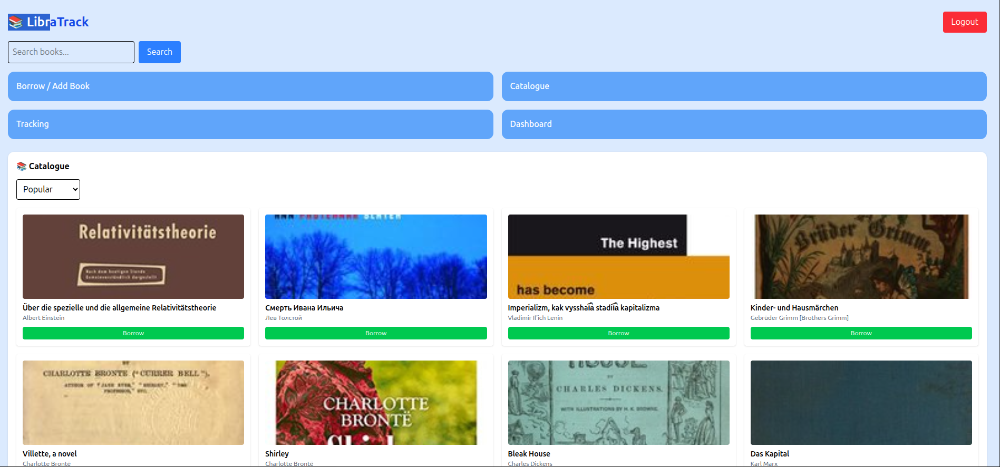
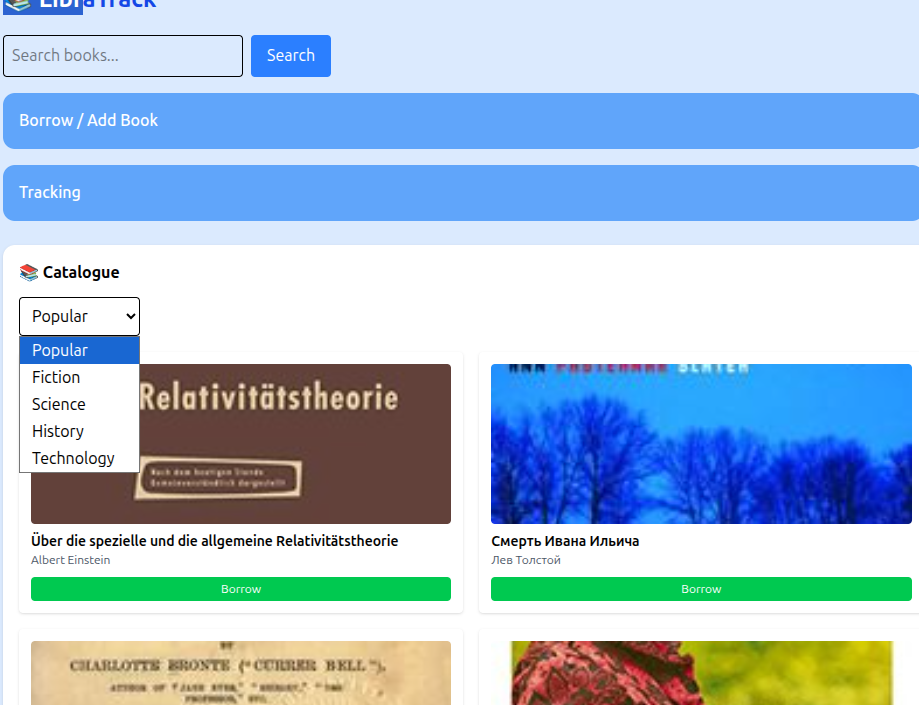
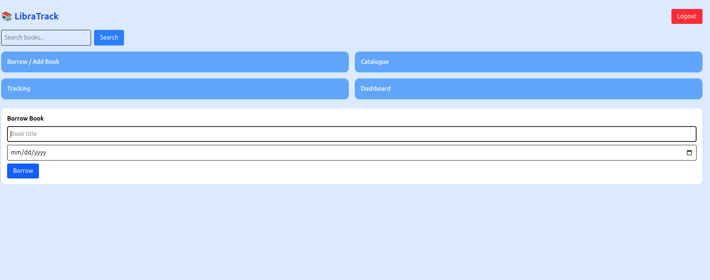
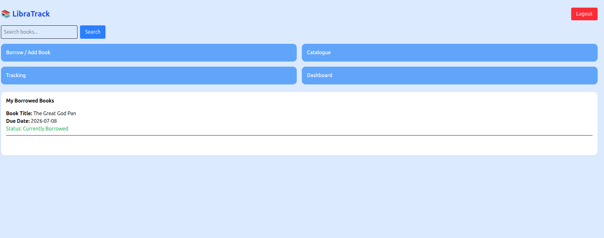
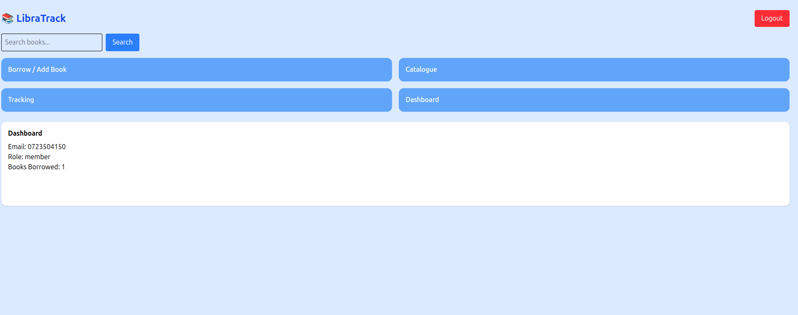

# 📚 LibraTrack

LibraTrack is a simple library management web application built with **HTML**, **CSS (Tailwind)**, and **JavaScript**.  
It allows users to register, log in, borrow books, track borrowed items, and manage overdue records — all stored in the browser using `localStorage`.

---

## 🚀 Features

- 🔑 **Authentication**
  - Register and login with email, password, and role (Member/Librarian).
  - Auto-login using `localStorage`.
  - Logout functionality to clear sessions.

- 📖 **Catalogue**
  - Search books via the Open Library API.
  - Display book details (title, author, cover).
  - Borrow books directly from search results.

- 📕 **Borrowing**
  - Borrow books with a due date.
  - Prevent duplicate borrowing of the same book.
  - Quick borrow option for faster checkout.

- 📊 **Tracking**
  - View borrowed books with status: *Currently Borrowed*, *Returned*, or *Overdue*.
  - Librarians can view overdue books across all users.

- 🖥️ **Dashboard**
  - Personalized dashboard showing user details and borrowed book count.

---

## 🛠️ Tech Stack

- **Frontend:** HTML + Tailwind CSS
- **Logic & Storage:** JavaScript + `localStorage`
- **API:** Open Library API (for book search)

---

## 📂 Project Structure


---

## 📸 Screenshots

 > 
 > 
 > 
 > 
 > 
 > 
 > 

 


- **Login & Registration Page**
- **Dashboard**
- **Catalogue Search**
- **Borrow Form**
- **Tracking & Overdue Records**

---

## ⚡ Getting Started

1. Clone the repository:
   ```bash
   git clone git@github.com:Brian022-mutai/libratrack.git

